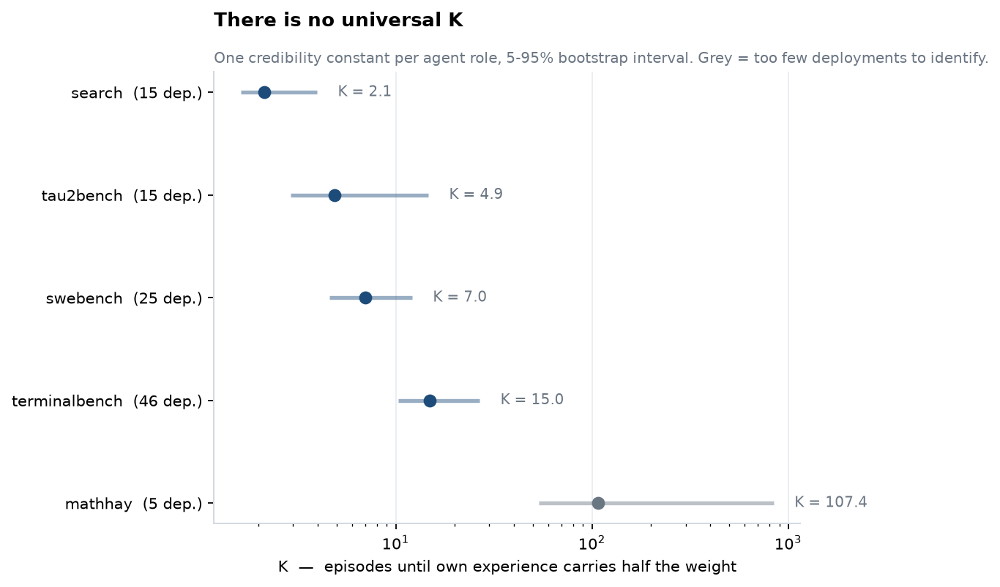
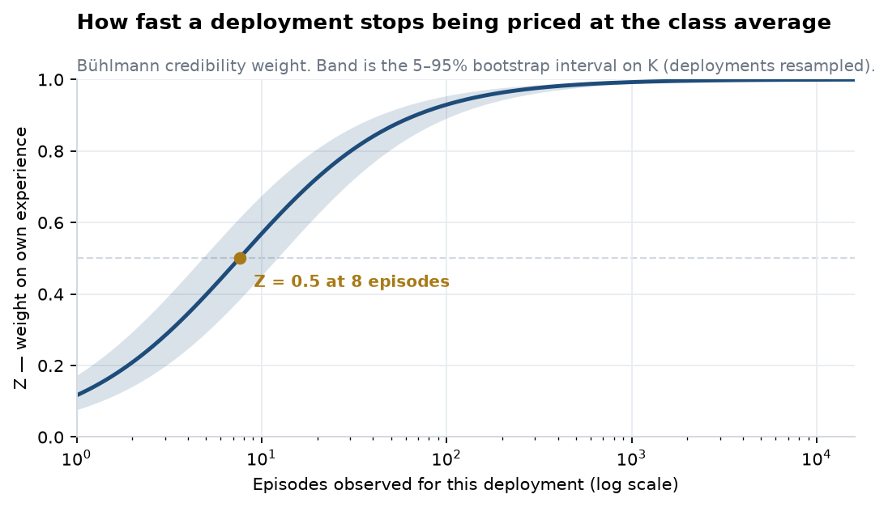
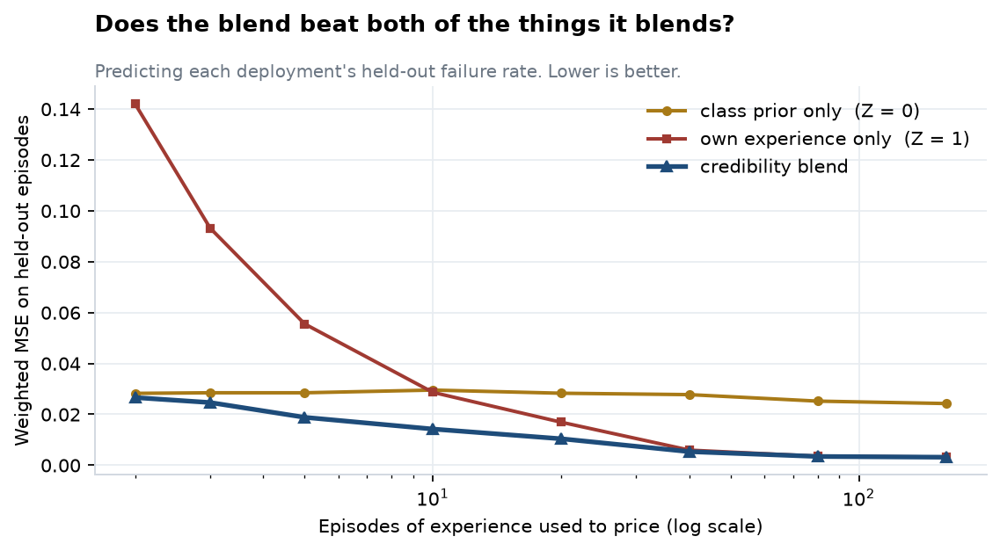
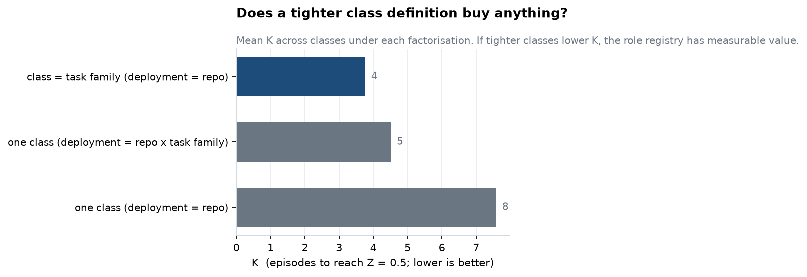
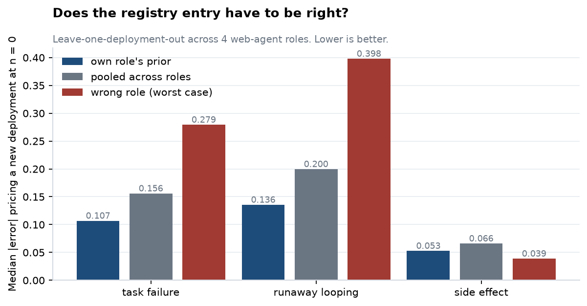
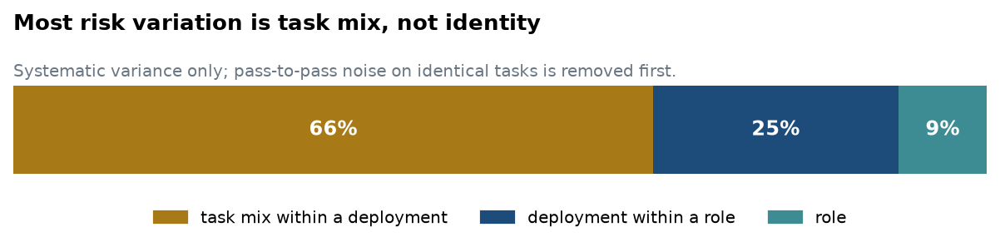

# Credibility for agents

**Does a pooled prior across agent deployments earn its keep, or does it collapse into the industry average that insurers reject?**

It earns its keep — and the constant behind it replicates across corpora that share nothing.

## The replication

| | corpus | models | K | 5–95% |
|---|---|---|---:|---|
| coding agent | SWE-smith, 24,100 episodes | Claude 3.7 Sonnet | **7.6** | [4.8, 12.2] |
| coding agent | cx-cmu `swebench`, 613 episodes | DeepSeek, Qwen, Gemini | **7.0** | [4.6, 12.1] |

Two independent measurements of the same quantity: different task sets, scored differently, run by different model families, sharing no code path beyond the estimator. They agree to within a rounding error and their intervals almost coincide. Neither was fitted to the other, and the second was not planned.

That is the load-bearing claim here — **K is a property of the agent's role, not an artifact of a dataset** — which is what makes a per-role prior something you can publish, sell and re-use rather than a number that dies with the corpus it came from.



And it is emphatically *per role*: across five roles K spans 7×, from a research agent at 2.1 to an ops agent at 15.0. A quoted K that does not name its role means nothing.

## What this is

The kill-switch experiment for an agent-insurance "base rate bureau", built to fail loudly if the idea does not work. Three corpora, ~40,000 episodes, 16 tests, every negative control reported.

It did not fail — but it did force one headline down. An early study put the share of risk explained by an agent's role at 54%. A larger corpus that could separate a level the first could not see puts it at **9%**, with task mix at 66%. That correction is below in full, and it shapes the product design more than any of the positive results do.



## Why this is the question

Insurability for AI agents attaches to *monitored roles*, not to agents ([arXiv 2606.16465](https://arxiv.org/pdf/2606.16465), Theorem 1: "General-purpose agents are not insurable objects by themselves"). Pricing a role needs a failure frequency, and the industry's own blueprint ([*Underwriting the Agent Economy*](https://www.underwriting-agents.com/report.pdf), July 2026) calls developing that frequency data "a priority for the industry" while rejecting industry-wide actuarial tables, because averages "gloss over these differences" between systems.

Bühlmann credibility resolves the contradiction:

```
p̂ = Z · (own experience) + (1 − Z) · (class prior),    Z = n / (n + K)
```

Nothing is overridden by an average — the average is only the fallback for what has not been observed yet. The whole proposition reduces to one estimated constant. `K = EPV / VHM`: expected process variance over variance of hypothetical means. **If deployments are noisy but alike, K explodes, Z stays near zero, and every deployment is priced at the class average forever.** That is the failure mode this repo was built to detect.

## Results

### The blend beats both of the things it blends



Predicting each deployment's held-out failure rate, weighted MSE:

| episodes of experience | class prior only | own experience only | credibility blend |
|---:|---:|---:|---:|
| 2 | 0.0282 | 0.1420 | **0.0266** |
| 5 | 0.0285 | 0.0555 | **0.0188** |
| 10 | 0.0295 | 0.0286 | **0.0142** |
| 20 | 0.0283 | 0.0169 | **0.0104** |
| 40 | 0.0277 | 0.0059 | **0.0053** |
| 160 | 0.0242 | 0.0032 | **0.0031** |

The blend wins at every size, and by roughly 2× at n = 10–20 where the two endpoints cross.

One finding worth its own line: **K must come from the pool, not from the deployment being priced.** Re-estimating K on each thin training slice biases it low (K̂ = 2.2 at n = 2 against a true 7.6), makes Z far too aggressive, and leaves the blend *worse than the prior alone* at n = 2–3. Both configurations are reported — `k_used` vs `k_refit_on_slice` in `out/e3_holdout_sweep.csv`.

### The pooled prior is worth about eight episodes of waiting

Leave-one-deployment-out, priced at n = 0 from the other deployments:

- pooled prior, day zero: median absolute error **0.1046**, within 0.10 for 46% of deployments
- own history needs **n = 8** before its median error (0.1023) matches that

Two independent computations landing on the same number — E4's eight episodes and K = 7.6 — is the internal consistency check, since `Z = 0.5` at `n = K` is exactly the claim that the prior is worth K episodes of own data.

### A tighter class definition halves K



Conditioning on task family takes mean K from 7.6 to 3.8, and some families far lower (`func_pm_remove_loop` 0.94, `combine_file` 1.94) while `lm_rewrite` is the stubborn outlier at 14.9. This is the quantitative case for a role class registry: defining the class more tightly measurably speeds up experience rating. Scaffold, by contrast, buys nothing.

### Which behavioural signals carry deployment identity

`error_rate` (K = 5.9) and `n_turns` (K = 8.2) separate deployments; action-mix diversity does not (`action_entropy` K = 30.7, `n_actions` K = 34.7). Instrument the first two.

## A second role: do roles actually separate?

The SWE-smith study has one agent and one model, so it can only measure heterogeneity between *customers*. The registry claim — that the class you price against must be the right **role** — needs more than one role. [AgentRewardBench](https://huggingface.co/datasets/McGill-NLP/agent-reward-bench) supplies four web-agent environments crossed with four agent models, 1,302 trajectories, each judged by a **human expert** rather than an automatic scorer, and carrying three distinct loss channels:

| channel | meaning | base rate | events |
|---|---|---:|---:|
| failure | task not accomplished | 0.72 | 948 |
| looping | agent cycled repetitively — runaway cost | 0.51 | 675 |
| side effect | agent changed something it should not — **the claimable one** | 0.065 | 87 |

Roles differ plainly in base rate: failure runs 0.62 (webarena) to 0.92 (assistantbench), looping 0.38 to 0.76.

### Role explains about half of deployment-level risk

A three-level decomposition (episode → deployment → role), debiasing each level for the sampling noise of its own means:

| channel | var between roles | var within roles | share explained by role |
|---|---:|---:|---:|
| failure | 0.0107 | 0.0093 | **53.5%** |
| looping | 0.0267 | 0.0212 | **55.7%** |
| side effect | 0.0003 | 0.0010 | 21.7% |

### Pricing from the wrong role costs 2.6–2.9×



Leave-one-deployment-out, priced at n = 0, median absolute error:

| channel | own role's prior | pooled across roles | wrong role (avg) | wrong role (worst) |
|---|---:|---:|---:|---:|
| failure | **0.107** | 0.156 | 0.191 | 0.279 |
| looping | **0.136** | 0.200 | 0.212 | 0.398 |
| side effect | 0.053 | 0.066 | 0.056 | *0.039* |

For task failure and runaway looping the registry is load-bearing: knowing the role beats pooling across roles by ~1.5×, and a mis-specified role entry costs 2.6–2.9× in day-zero pricing error. That is the registry's value, measured.

**The side-effect channel inverts, and it should not be explained away.** The wrong-role prior prices side effects *better* than the right one. The reason is that all four role means sit between 0.023 and 0.095 — close together and near zero — so "furthest role" is picking noise, and any small number scores well. With 87 events across 54 deployments there are roughly 1.6 events per deployment. **The loss channel that matters most for insurance is exactly the one this data cannot establish role separation for**, because catastrophic events are rare. That is a data requirement, not a result: pricing the claimable channel needs a corpus with far more side-effect events than any public dataset currently has.

### Power at this scale is much weaker

Re-running the power analysis at the web study's actual size (54 deployments, median 19 episodes) rather than the SWE-smith size: K is recovered reliably only up to **K ≈ 25**, with a 24% false-kill rate by K = 100. The web results are directional and should not be quoted as point estimates. The SWE-smith K ≈ 7.6 is the one with an envelope behind it.

### Label noise is real and measured

105 trajectories were annotated twice. Expert-vs-expert agreement: κ = 0.755 (failure), 0.769 (looping), 0.646 (side effect). So roughly 11% of failure labels are disagreements between qualified humans — a floor on EPV that no model can go below, and a reminder that "ground truth" here is a judgement.

## Six roles: the strongest study, and a correction

[cx-cmu/agent_trajectories](https://huggingface.co/datasets/cx-cmu/agent_trajectories) (gated) spans genuinely different jobs rather than variants of one: web research, customer service, terminal operations, coding, MCP tool use and maths reasoning, across 5 models, **8,653 episodes**. Crucially every task is attempted up to **four times by the same model**, so pass-to-pass variance measures run-to-run noise on *identical work* — the first clean read on process variance in this repo.

`mcpbench` is excluded. Its reward is not binary (261 distinct values, mean 3.17) and is on a scale the other five do not share; thresholding it into a loss would pool two different quantities. That leaves 5 roles, 106 deployments, 7,598 episodes.

### There is no universal K


| role | K | 5–95% | deployments | loss rate |
|---|---:|---|---:|---:|
| search | 2.1 | [1.6, 4.0] | 15 | 0.78 |
| tau2bench (customer service) | 4.9 | [2.9, 14.7] | 15 | 0.61 |
| swebench (coding) | 7.0 | [4.6, 12.1] | 25 | 0.78 |
| terminalbench (ops) | 15.0 | [10.3, 26.8] | 46 | 0.81 |
| mathhay | 107.4 | [53.6, 843.5] | 5 | 0.54 |

K ranges **7×** across identifiable roles. A research agent earns experience rating after ~2 episodes; an ops agent needs ~15. `mathhay` has only one domain, so 5 deployments and an interval spanning an order of magnitude — unidentified, and shown grey rather than quietly dropped.

**An unplanned replication.** `swebench` here gives K = 7.0 [4.6, 12.1]. The SWE-smith study gave K = 7.6 [4.8, 12.2] — a different corpus, different task set, and different models (DeepSeek / Qwen / Gemini here versus Claude 3.7 Sonnet there). Two independent measurements of the coding-agent credibility constant landing on the same number is the strongest evidence in this repo that K is a property of the role rather than of a dataset.

### Most risk variation is task mix, not identity



With pass-to-pass noise (0.0794) removed first, the systematic variance splits:

| level | variance | share of systematic |
|---|---:|---:|
| task mix within a deployment | 0.0765 | **65.7%** |
| deployment within a role | 0.0293 | 25.2% |
| role | 0.0106 | 9.1% |

**This corrects the earlier reading.** The AgentRewardBench study put role at ~54%, but it compared role against deployment only and had no task level to attribute to. Given a corpus that can separate all four levels, most of what looks like "this deployment is risky" is really "this deployment runs harder tasks."

Three consequences, and only the first is comfortable:

- Credibility still works. Collapsing passes and pricing task-level means gives K = 2.96 [2.06, 4.98] — deployments genuinely differ, and the estimator still earns its keep.
- **The exposure base must be task-mix aware.** Pricing a deployment on identity alone prices its task mix by accident. This is independent support for the trace-economic paper's insistence that the insurable unit is a role with *bounded task scope*, not an agent.
- Role explains 9% of systematic variance here, not 54%. It is a real effect and it sets the prior you start from, but it is the smallest of the three terms. A role registry is necessary and nowhere near sufficient.

Run-to-run noise is also large — 0.0794, comparable to task mix at 0.0765. The same agent, given the same task twice, often disagrees with itself. That is a floor on how well *any* per-deployment estimate can do.

## The recorder

Measuring K on a corpus somebody else collected is research. Instrumenting a live fleet is the product. `credibility.recorder` is the collection half: **stdlib only, no dependencies**, drops into any agent loop.

```python
from credibility.recorder import Recorder, ToolSpec, Capability, Reversibility

rec = Recorder(
    deployment_id="acme-prod",
    role="customer_support",
    tools=[
        ToolSpec("search_orders",
                 capabilities=frozenset({Capability.PRIVATE_DATA}),
                 reversibility=Reversibility.REVERSIBLE),
        ToolSpec("issue_refund",
                 capabilities=frozenset({Capability.EXTERNAL_EFFECT}),
                 reversibility=Reversibility.IRREVERSIBLE),
    ],
    declared_capabilities={Capability.PRIVATE_DATA},   # never trusted
)

with rec.episode(task_id="ticket-8821") as ep:
    ep.action("search_orders", output_chars=412)
    ep.action("issue_refund")
    ep.resolve(success=True)
```

`PYTHONPATH=src python examples/quickstart.py` runs a three-customer fleet end to end and prices it.

### Content cannot leak, because it cannot get in

The usual arrangement is a redaction pipeline: a deny-list that strips the sensitive things someone thought of, which has to be audited and trusted. This inverts it.

- **The API has no parameter that accepts free text.** `action()` takes a tool name, an error flag and `output_chars` — a *length*. The tool output never enters the SDK, so it cannot be forgotten in a buffer or logged by accident.
- **Identifiers are salted and hashed** per deployment. Task ids are routinely email addresses or account numbers; they stay linkable within a deployment (which is what credibility needs) without the raw value travelling.
- **Tool names never reach the wire.** The recorder holds them in-process to compute entropy and capability usage; the outbound record carries counts and hashes only.
- **The wire format is an allow-list.** Every field must be a number, a bool, a null, a value from a fixed enum, or a hex digest. `validate()` refuses anything else, and `to_wire()` cannot be called without it running.

The test that matters is `test_canary_never_reaches_the_wire`: an `SSN`-shaped canary is pushed into the deployment id, the role, the task id, the tool name and its description, and the assertion is that it appears nowhere in the payload — not in a value, not in a key, not in the JSON. That test is the privacy review.

A full record looks like this, and this is all of it:

```json
{"deployment_id":"fdf3d47fa257542d","envelope_class":"C111-I0","episode_id":"a6b1be3e8c254f59",
 "error_rate":0.0,"escalated":false,"manifest_hash":"fa89b11ed297a47d",
 "max_reversibility":"irreversible","n_actions":6,"n_distinct_tools":3,"n_irreversible":1,
 "n_mutating":1,"observed_capabilities":["external_effect","private_data","untrusted_input"],
 "output_chars":4101,"pass_index":1,"repeat_rate":0.6,"resolved":true,"reward":null,
 "role":"customer_support","task_hash":"5ddb12eaa459eb73","tool_entropy":1.251629}
```

### The task envelope is derived, not declared

A declared envelope is an incentive to lie — premiums fall as scope narrows, and a wrong class label measurably costs 2.6–2.9× in day-zero pricing error. So scope is derived from the tool manifest the agent is actually wired to, and the declaration is kept only as a cross-check.

Three views are tracked and **none is resolved into a single verdict**:

| view | source | trusted |
|---|---|---|
| derived | the granted tool manifest | yes |
| observed | what the agent actually exercised | yes |
| declared | what the customer said | no |

Disagreement between them is itself the signal. Understatement is weighted double, because it is the direction a premium-minimising customer errs in. In the quickstart the customer declares `private_data`, the wiring grants all three capabilities, and the recorder reports a **rule-of-two violation** with a divergence score of 4.0 — the agent can read untrusted email, reach private orders, and issue irreversible refunds, which is a complete attack chain.

The `class_code` (`C111-I0`) keys on *powers*, not tool names: two customers whose differently named tools grant the same capabilities are the same risk class and should price the same. The manifest hash tracks powers too — rewording a tool's description does not change it, granting that tool a new capability does.

Tools that declare nothing fall back to keyword priors, and anything inferred that way is counted in `inferred_tools` so a premium can be loaded for the uncertainty. A guess is flagged as a guess.

### OpenTelemetry

`to_otel_attributes()` emits `gen_ai.*` and `agent.credibility.*` span attributes for an integrator's existing tracer, validated on the way out. The package takes no OTel dependency.

## Trusting the number

The estimator is validated against a closed-form answer before use. For a Beta(a,b)-Bernoulli class the credibility constant is exactly `a + b`, so there is a known target: `pytest` checks recovery across three concentration regimes and four seeds (16 tests).

A power analysis (`credibility/power.py`) settles interpretation in advance, because a noisy estimator returns "K is enormous" both when there is nothing to see and when there is something to see and too little data to see it — opposite business conclusions. At this design's scale, K is recovered unbiased up to **K ≈ 500 with a 0% false-kill rate**. The measured 7.6 sits two orders of magnitude inside that envelope.

## Honest limits

- **The SWE-smith study has one agent and one model.** Every episode there is SWE-agent + Claude 3.7 Sonnet, so its heterogeneity is between *customers* (repositories). The role question is answered separately, on AgentRewardBench, at much smaller scale.
- **Outcome is task-driven.** 13,501 distinct tasks are attempted up to 21 times each, and 82% of repeated tasks resolve identically. Much of the between-deployment variance is task-mix difficulty rather than behavioural difference.
- **No timestamps, so no drift test.** The past/future split is a seeded shuffle. This measures generalisation to unseen episodes, *not* resistance to temporal drift — the half of the thesis that says a decaying prior beats a stale table remains untested and needs timestamped fleet data.
- **`resolved` is a proxy for a claimable loss**, not a real loss. No dollar severity is modelled here.
- **The three dataset splits are not three populations.** `xml` and `ticks` cover the same 13,500 instances and agree on outcome 97% of the time — they are largely the same trajectories re-serialised. Treating scaffold as a deployment dimension would have inflated the result; the analysis uses one scaffold at a time and replicates across all three (K = 7.59 / 8.28 / 8.08).

## Running it

```bash
pip install -e ".[data,plots,dev]"
python -m credibility.extract --out data/episodes.parquet   # ~45 min, streams 4.2 GB
python -m credibility.experiment --episodes data/episodes.parquet --out out
python -m credibility.plots --out out
pytest
```

Data: [`SWE-bench/SWE-smith-trajectories`](https://huggingface.co/datasets/SWE-bench/SWE-smith-trajectories) — 76,002 trajectories from SWE-agent + Claude 3.7 Sonnet. Extraction emits counts, rates and entropies per episode; no prompt or source text leaves the trajectory.

## Layout

| path | what |
|---|---|
| `src/credibility/extract.py` | trajectories → per-episode behavioural features |
| `src/credibility/buhlmann.py` | Bühlmann-Straub variance components, Z, bootstrap CI |
| `src/credibility/experiment.py` | E1 class definitions, E3 holdout sweep, E4 cold start, E5 signals |
| `src/credibility/recorder/` | the SDK: derived envelope, episode recording, wire format |
| `examples/quickstart.py` | instrument a fleet, emit records, price it |
| `src/credibility/cx.py` | six-role corpus: per-role K, four-level decomposition |
| `src/credibility/cx_probe.py` | schema probe for the gated corpus, reads footers only |
| `src/credibility/webagents.py` | AgentRewardBench expert annotations -> web-agent episodes |
| `src/credibility/role_separation.py` | R1 role decomposition, R2 cross-role cold start |
| `src/credibility/power.py` | how small a K this design could detect |
| `src/credibility/plots.py` | the four figures |
| `tests/` | estimator validation against the Beta-Bernoulli closed form |
